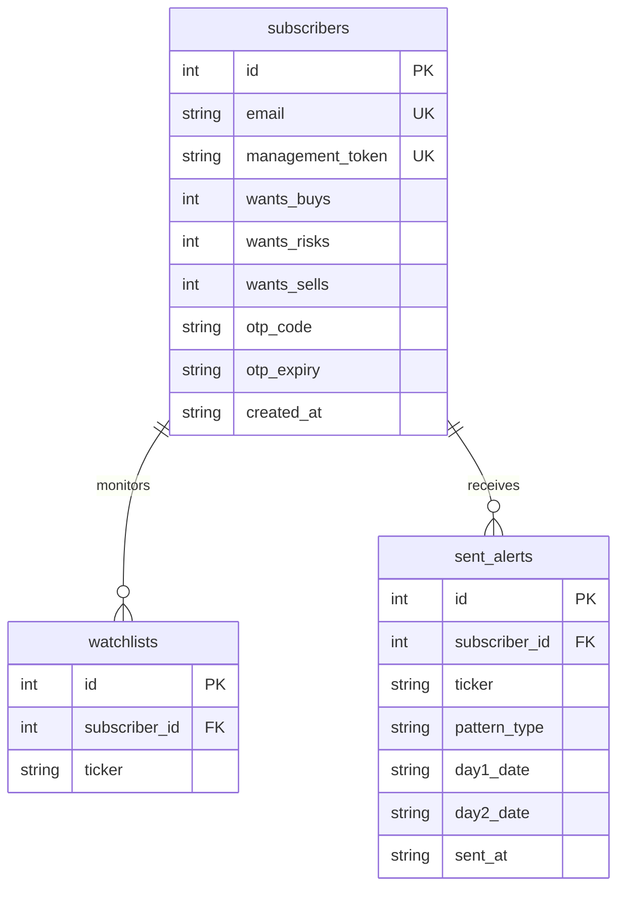

# 📈 Candlestick Sentinel

**Candlestick Sentinel** is a full-stack algorithmic trading analysis system, web dashboard, and automated email alert scanner built with Python, Streamlit, and SQLite. 

The application monitors stock watchlists for high-probability candlestick pattern reversals (**Hammer** for bullish reversals and **Hanging Man** for bearish reversals/warnings). It enforces a strict **3-day validation lifecycle** to eliminate lookahead bias, calculates exact 2:1 reward-to-risk trade blueprints, enriches signals with optional AI market analysis (OpenAI / Groq), and delivers styled HTML alerts directly to subscribers.

---

## 🚀 Key Features

* **Rigid Pattern Detection**: Uses geometrical, volume, and indicator rules to identify Hammer and Hanging Man candlestick shapes.
* **3-Day Confirmation Lifecycle**: Ensures zero lookahead bias by requiring Day 2 candle confirmation before generating Day 3 entry parameters.
* **Automated Daily Background Scanner**: Headless CLI script (`daily_scanner.py`) suitable for cron jobs or Windows Task Scheduler.
* **Interactive Streamlit Web Dashboard**: User authentication via 6-digit OTP codes, watchlist management, preference customization, live scanner, and backtest sandbox.
* **Historical Backtesting Engine**: Test trading performance on any stock ticker over 2-year historical windows with detailed metrics (win rate, average return, win/loss breakdown, and trade logs).
* **AI Analyst Layer (Optional)**: Synthesizes technical setups with plain-English market summaries, caution flags, and news/sector context using OpenAI (`gpt-5.4-nano` / web search) or Groq (`llama-3.3-70b-versatile`).
* **HTML Email Notification Delivery**: Sends responsive HTML trade blueprints via SMTP (Gmail, custom server) with automatic fallback to simulated console logs.
* **SQLite Persistence**: Dedicated local database (`sentinel.db`) tracking subscribers, watchlists, preferences, OTP codes, and duplicate alert history.

---

## 📐 3-Day Validation Cycle (Strategy Logic)

Trading candlestick patterns on the day of formation without confirmation often results in false signals. Candlestick Sentinel enforces a rigid 3-day validation process:

```
┌────────────────────────┐      ┌────────────────────────┐      ┌────────────────────────┐
│     DAY 1: SETUP       │      │  DAY 2: CONFIRMATION   │      │   DAY 3: EXECUTION     │
│                        │      │                        │      │                        │
│ Geometric shape match  │ ---> │ Hammer: Close2 > High1 │ ---> │ Entry: Day 3 Open      │
│ (Hammer / Hanging Man) │      │ Hanging Man: Close2 <  │      │ Stop Loss: Day 1 Low/Hi│
│ Volume & RSI check     │      │            Low1        │      │ Target: 2:1 R/R Ratio  │
└────────────────────────┘      └────────────────────────┘      └────────────────────────┘
```

1. **Day 1 (Setup Candle)**: 
   - **Hammer** (Bullish Reversal): Lower shadow $\ge 2.0\times$ body size; upper shadow $\le 10\%$ total range or $\le 20\%$ body; RSI oversold/neutral ($<50$); close near low of recent trend.
   - **Hanging Man** (Bearish Reversal): Identical geometric shape forming at the top of an uptrend or in overbought RSI territory ($\ge 50$).
   - **Confidence Score (0–100)**: Calculated based on RSI depth, volume multiplier relative to 20-day Volume MA ($\ge 1.5\text{x}$), and proximity to 50-day / 200-day Simple Moving Averages.
2. **Day 2 (Confirmation Candle)**: 
   - Wait for the close of Day 2.
   - **Hammer Confirmation**: $\text{Close}_2 > \text{High}_1$ (buyers confirmed upward momentum).
   - **Hanging Man Confirmation**: $\text{Close}_2 < \text{Low}_1$ (sellers confirmed downward pressure).
   - Unconfirmed setups are automatically discarded.
3. **Day 3 (Execution & Blueprint Generation)**: 
   - **Entry Price**: Estimated at Day 3 Open (or Day 2 Close).
   - **Gap Risk Validation**: If Day 3 opens past the stop-loss level, the setup is invalidated and aborted.
   - **Stop Loss**: 
     - Hammer (Long): $\text{Day 1 Low} - 0.01$
     - Hanging Man (Short): $\text{Day 1 High} + 0.01$
   - **Profit Target**: Calculated using a $2:1$ Reward-to-Risk ratio:
     - Hammer: $\text{Entry} + 2.0 \times (\text{Entry} - \text{Stop Loss})$
     - Hanging Man: $\text{Entry} - 2.0 \times (\text{Stop Loss} - \text{Entry})$
   - **Exit Rules**: Stop Loss hit, Profit Target hit, or time exit at the close of the 10th trading bar.

---

## 🛠️ System Architecture & File Structure

```
hammer_candlestick_app/
│
├── app.py               # Streamlit UI (Auth, Watchlist, Scanner, Backtester)
├── pattern_engine.py    # Technical Analysis engine (yfinance, RSI, SMAs, Pattern rules)
├── daily_scanner.py     # Headless background daily scan script (CLI / Task Scheduler)
├── backtest.py          # Strategy backtester engine with zero lookahead bias
├── database.py          # SQLite interface (sentinel.db schema & query helper functions)
├── analyst_engine.py    # AI analyst integration layer (OpenAI / Groq API calls)
├── notifier.py         # HTML email formatter & SMTP delivery engine
├── local_env.py         # Lightweight .env loader without third-party dependencies
├── requirements.txt     # Python package dependencies
├── .env.example         # Environment configuration template
└── sentinel.db          # SQLite database (auto-generated on first run)
```

### Module Responsibilities

* **[app.py](file:///c:/Users/Devin/Documents/hammer_candlestick_app/app.py)**: Main entry point for the Streamlit web application. Handles OTP sign-in/registration, watchlist modification, preference toggles, live watchlist scanning, visual HTML email previews, and backtest execution.
* **[pattern_engine.py](file:///c:/Users/Devin/Documents/hammer_candlestick_app/pattern_engine.py)**: Downloads price data via `yfinance`, calculates Wilder's 14-period RSI, 50/200 SMAs, 20-day Volume MA, evaluates geometric candle rules, and computes confidence scores.
* **[daily_scanner.py](file:///c:/Users/Devin/Documents/hammer_candlestick_app/daily_scanner.py)**: Batch processes all registered subscribers, downloads ticker data (with caching to avoid redundant API hits), evaluates user alert preferences, performs gap risk checks, enriches signals with AI context, checks duplicate sent alerts, and dispatches email notifications.
* **[backtest.py](file:///c:/Users/Devin/Documents/hammer_candlestick_app/backtest.py)**: Simulates the 3-day strategy across 2 years of historical daily data, enforcing strict entry/exit conditions and returning trade logs and performance metrics.
* **[database.py](file:///c:/Users/Devin/Documents/hammer_candlestick_app/database.py)**: SQLite interface managing `subscribers`, `watchlists`, and `sent_alerts` tables, foreign keys, unique constraints, and OTP generation/verification.
* **[analyst_engine.py](file:///c:/Users/Devin/Documents/hammer_candlestick_app/analyst_engine.py)**: Constructs structured prompts for AI models, optionally uses OpenAI web search preview to inspect recent news/earnings context, and validates JSON responses for email rendering.
* **[notifier.py](file:///c:/Users/Devin/Documents/hammer_candlestick_app/notifier.py)**: Renders CSS-styled HTML email alert templates containing trading blueprints, risk math, AI notes, and technical indicator metrics. Handles SMTP TLS transmission.

---

## 📦 Setup & Installation

### 1. Prerequisites
* Python 3.9 or higher
* `pip` package manager

### 2. Clone Repository & Setup Virtual Environment
```bash
git clone <repository-url>
cd hammer_candlestick_app

# Create a virtual environment
python -m venv venv

# Activate virtual environment
# On Windows:
venv\Scripts\activate
# On macOS/Linux:
source venv/bin/activate
```

### 3. Install Dependencies
```bash
pip install -r requirements.txt
```

---

## ⚙️ Environment Configuration

Copy `.env.example` to `.env` in the project root directory:

```bash
cp .env.example .env
```

Edit `.env` to configure your email SMTP server and AI provider options:

```ini
# SMTP Email Credentials (Optional - Falls back to console logging if omitted)
SMTP_SERVER=smtp.gmail.com
SMTP_PORT=587
SMTP_USERNAME=your.email@gmail.com
SMTP_PASSWORD=your_gmail_app_password

# AI Analyst Provider Settings ("groq" or "openai")
AI_PROVIDER=openai
OPENAI_API_KEY=your_openai_api_key
GROQ_API_KEY=your_groq_api_key

# AI Analyst Behavior
AI_ANALYST_ENABLED=true
AI_ANALYST_MODEL=gpt-5.4-nano
AI_ANALYST_WEB_SEARCH=false
```

> **Note**: For Gmail SMTP delivery, generate an **App Password** via your Google Account Security settings.

---

## 🖥️ Running the Application

### 1. Start the Streamlit Web App
Launch the interactive control panel:
```bash
streamlit run app.py
```
Open your browser at `http://localhost:8501`.

#### Web App Features:
1. **Authentication**: Enter your email to receive a 6-digit OTP code. (In local development, the generated code is also displayed in a developer banner).
2. **Watchlist & Preferences**: Add/remove tickers (e.g., `NVDA`, `AMD`, `PLTR`), toggle alert categories (**Buy Opportunities**, **Risk Warnings**, **Sell Alerts**), or test email sending.
3. **Live Watchlist Scanner**: Interactively scan your watchlist over the past 10 trading days and inspect the rendered HTML alert layout.
4. **Backtester Sandbox**: Run a 2-year strategy backtest for any ticker symbol to inspect trade logs and performance metrics.

---

### 2. Run the Daily Background Scanner
Run the daily scanner CLI script manually or schedule it:
```bash
python daily_scanner.py --days 3
```

#### CLI Options:
* `--days` (default: `3`): Specifies how many past daily bars to scan for confirmed setups.

#### Automating with Cron (Linux/macOS):
To run the scanner every weekday at 4:30 PM EST (after market close):
```cron
30 16 * * 1-5 /path/to/venv/bin/python /path/to/hammer_candlestick_app/daily_scanner.py --days 3 >> /path/to/daily_scanner.log 2>&1
```

#### Automating with Windows Task Scheduler:
1. Create a basic task in Windows Task Scheduler.
2. Action: **Start a program**.
3. Program: `C:\path\to\venv\Scripts\python.exe`
4. Arguments: `daily_scanner.py --days 3`
5. Start in: `C:\path\to\hammer_candlestick_app`

---

## 🧪 Backtesting Engine

The backtesting engine (`backtest.py`) evaluates historical strategy performance while strictly adhering to the 3-day validation rules:

* **Zero Lookahead Bias**: Pattern identified on Day 1 $\to$ Confirmation verified on Day 2 $\to$ Entry executed at Day 3 Open.
* **Trade Management**: Stop Loss set to Day 1 Low/High $\pm 0.01$, Take Profit set at 2:1 R/R ratio.
* **Max Hold Time**: Trades automatically exit at market close on the 10th bar if neither Stop Loss nor Take Profit is hit.
* **Performance Metrics Output**:
  - Total Trades Executed
  - Win Rate (%)
  - Average Return per Trade (%)
  - Breakdown of Wins, Losses, and Timeouts
  - Detailed Trade Log DataFrame

---

## 🤖 AI Analyst Integration

When enabled (`AI_ANALYST_ENABLED=true`), the system sends detected technical setups to the configured AI provider after pattern confirmation.

* **OpenAI Integration**: Supports standard completion models and web search tools (`web_search_preview`) to fetch live news, earnings schedules, and sector developments.
* **Groq Integration**: Fast inference using models such as `llama-3.3-70b-versatile`.
* **Structured Output**: Returns structured JSON containing:
  - `status`: AI availability indicator.
  - `summary`: Concise beginner-friendly explanation of market conditions.
  - `caution_flags`: List of key risk factors (e.g., upcoming earnings, high volatility).
  - `supporting_context`: Broad sector or macroeconomic context.
  - `plain_english_takeaway`: Bottom-line summary for beginners.

---

## 🗄️ Database Schema

The SQLite database (`sentinel.db`) consists of three relational tables:



---

## ⚠️ Disclaimer

* **Educational & Informational Purpose Only**: Candlestick Sentinel is built for technical analysis research and educational purposes. It does **not** provide financial, investment, or legal advice.
* **Market Risk**: Trading stocks, options, and financial instruments involves substantial risk of loss. Always perform independent research and consult a licensed financial advisor before executing real financial transactions.
