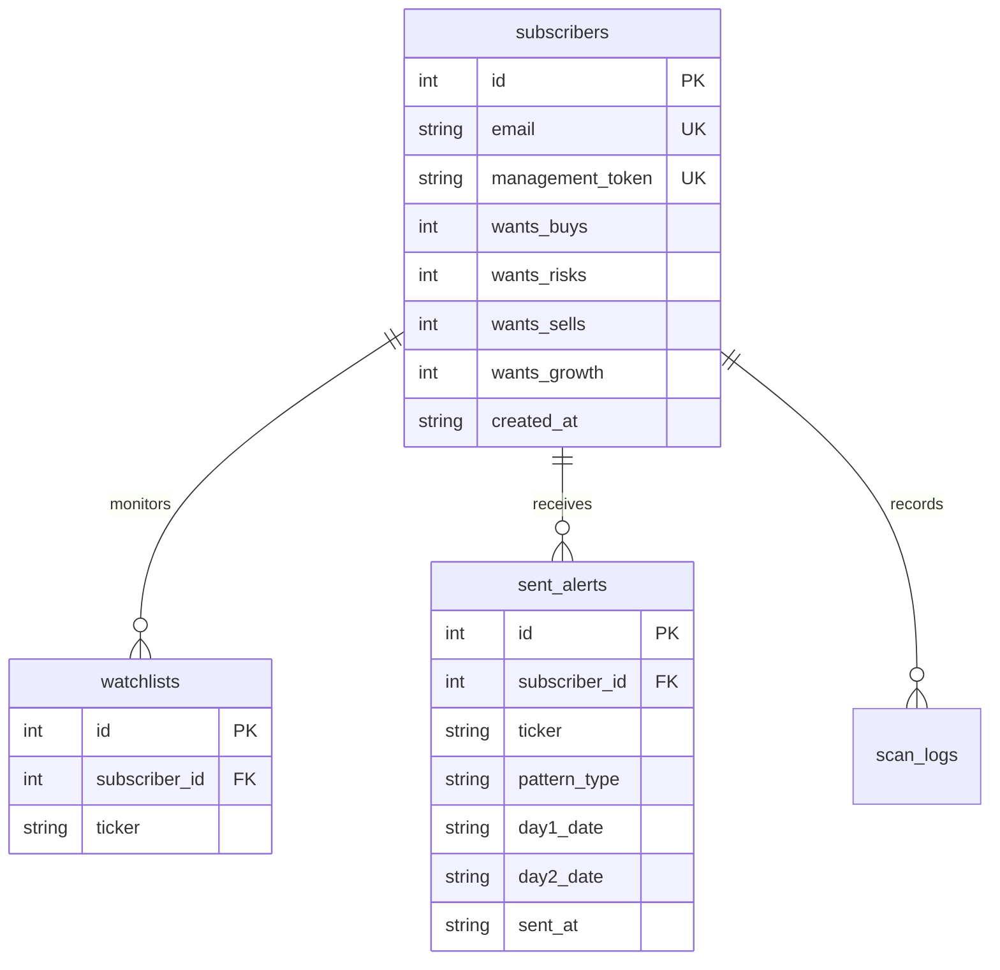

# 🛰️ TRadar — AI Market Intelligence & Growth Catalyst Engine

**TRadar** is a full-stack algorithmic trading analysis system, real-time web dashboard, and automated email alert scanner built with Python, Streamlit, Plotly, and SQLite.

The application combines **algorithmic technical pattern detection** with **whole-market fundamental AI news evaluation**. It monitors watchlists for high-probability candlestick pattern reversals (**Hammer** buy setups and **Hanging Man** risk warnings) using a strict **3-day confirmation lifecycle**, while simultaneously scanning the entire US stock market for **high-volume growth catalysts & unexpected contract wins** powered by an intelligent multi-model AI analyst fallback chain (Groq Llama 3.3-70B, Groq 8B, and Google Gemma 4).

---

## 🚀 Core Feature Suites

### 1. 📊 Candlestick Technical Reversal Engine
* **Rigid Pattern Detection**: Evaluates geometric proportions, volume spikes, and 14-period Wilder's RSI to detect Hammer and Hanging Man setups.
* **3-Day Confirmation Lifecycle**: Eliminates lookahead bias by requiring Day 2 candle confirmation before generating Day 3 entry parameters.
* **2:1 Reward-to-Risk Trade Blueprints**: Calculates exact Entry Price (Day 3 Open), Stop Loss (Day 1 Low/High $\pm \$0.01$), and Profit Target ($2:1$ R/R ratio).
* **Gap Risk Protection**: Automatically invalidates setups if price gaps past the stop-loss level at market open.

### 2. 🚀 Whole-Market AI Growth & Hidden Gem Catalyst Engine
* **Market-Wide Screener**: Continuously monitors US equities via Yahoo Finance real-time screeners (`most_actives`, `day_gainers`, `small_cap_gainers`, `aggressive_small_caps`, `growth_technology_stocks`).
* **Volume Surge Filtering**: Identifies stocks experiencing abnormal volume spikes ($\ge 2.0\text{x}$ 20-day Volume MA).
* **Real-Time News Aggregation**: Scrape Google News RSS feeds for catalyst keywords (contract wins, FDA approvals, earnings beats, strategic partnerships, acquisitions).
* **AI Fundamental Scoring**: Evaluates catalyst quality on a scale of $1.0 - 10.0$, generating alerts for high-growth catalysts ($\ge 7.0/10$).

### 3. ⏰ Market-Aligned Auto-Schedulers
* **Pre-Market Run — 9:00 AM EST** *(30 minutes before Open)*: Delivers fresh trade blueprints and evaluates overnight news before the opening bell.
* **Post-Market Run — 4:30 PM EST** *(30 minutes after Close)*: Analyzes official closing prices and screens after-hours contract wins.
* **Background Daemon Thread**: Runs headless inside Streamlit or CLI daemon loop (`init_scheduler_daemon()`) without blocking UI responsiveness.

### 4. 🤖 Multi-Model AI Analyst & Resilient Fallback Cascade
* **Automated Cascading Chain**: If a provider returns rate limit (HTTP 429) or quota errors, the engine seamlessly falls back down the chain:
  $$\text{Groq Llama 3.3-70B} \longrightarrow \text{Groq Llama 3.1-8B} \longrightarrow \text{Google Gemma 4} \longrightarrow \text{Gemini Flash}$$
* **Model Selection Override**: Control panel selector allows instant testing of specific AI models (`Groq-70B`, `Groq-8B`, `Gemma-4`, `Gemini-Flash`).
* **Active Model Email Badging**: Every email notification explicitly states the exact AI model that performed the evaluation (e.g. `🤖 Gemma-4 (gemma-4-26b-a4b-it)`).

### 5. 📈 Interactive Financial Analysis & Live Auto-Refresh
* **Dedicated Stock Analysis Pages**: Full financial stats, Plotly gradient area & candlestick charts, 50/200 SMAs, RSI (14), historical signals, and 2-year strategy backtest logs.
* **Live Quote Auto-Refresh**: Powered by Streamlit `@st.fragment` to update prices & charts without full-page reloads (`1s Ultra-Fast`, `15s Fast`, `30s Recommended`, `60s`, `Off`) alongside a manual `🔄 Refresh Quote Now` button. The `🚀 1s (Ultra-Fast)` mode silently suppresses all Streamlit loading indicators for a seamless, flicker-free live-updating experience.

### 6. 📧 Styled HTML Email Notifications
* **Technical Trade Alerts**: Contains setup confidence scores, trade blueprint cards (Entry, Stop Loss, Target), risk math, and AI technical summaries.
* **Growth Catalyst Alerts**: Includes live stock price, volume surge multiplier, AI catalyst rating, key drivers, risks, and clickable news headline links.

### 7. 🧠 Post-Trade Outcome Tracker & Self-Learning Feedback Loop
* **Automated Outcome Resolver**: Evaluates pending alerts against post-alert daily price history over a 10-bar horizon to resolve outcomes (`🟢 WIN (Target Hit)`, `🔴 LOSS (Stop Hit)`, `⏳ TIMEOUT`).
* **Dynamic Win-Rate Score Calibration**: Automatically boosts pattern confidence scores by up to **+15 points** for high-performing setups ($\ge 70\%$ win rate) or penalizes scores by up to **-20 points** for low-performing setups ($\le 50\%$ win rate).
* **AI Track Record Injection**: Injects empirical stock win rates directly into Groq & Gemma prompts for context-aware email takeaways.
* **Outcome Performance Audit Matrix**: Live web dashboard table presenting resolved signals, historical win rates, net returns, and clean N/A data formatting.

### 8. 🔍 Instant Stock Search & Deep-Dive Analysis Tab
* **3-Tab Control Panel Navigation**: Clean 3-tab dashboard architecture (`📋 Watchlist`, `🔍 Stock Search & Deep-Dive`, `⚡ Scanner, Alerts & Backtesting`).
* **Any Stock Lookup**: Dedicated search tab (`🔍 Stock Search & Deep-Dive`) allows instant financial, indicator, pattern signal, and strategy backtest analysis on any US stock ticker without requiring permanent watchlist addition.
* **Dual Action Buttons**: Quick-action bar in the Watchlist tab provides side-by-side `🔍 Analyze` and `➕ Add Stock` buttons.
* **Form Reset & Clear Search**: Form features `clear_on_submit=True` and a `❌ Clear Search` button to instantly wipe the text box and reset search results.
* **Smart Back Button Hiding**: When viewing stock details inside the Search Tab, the redundant `← Back to Control Panel` button is automatically concealed to keep the navigation bar clean.


---

## 🔍 Detailed Scanner Criteria & Functional Specs

The application features two specialized, complementary scanning engines. Below is the exact breakdown of how each scanner operates, what criteria it enforces, and how triggers are evaluated:

| Feature | 📊 Candlestick Technical Reversal Engine | 🚀 Whole-Market AI Growth & Catalyst Engine |
| :--- | :--- | :--- |
| **Script Path** | `scanners/daily_scanner.py` | `scanners/growth_scanner.py` |
| **Scan Universe** | User Watchlists (`AMD`, `NVDA`, `PLTR`, etc.) | Whole US Stock Market (~100–150 candidates screened) |
| **Market Data** | Daily OHLCV Price Action + RSI(14) + 20-Day SMA/EMA | Real-time Volume Surge + Yahoo Market Screeners + News RSS |
| **Core Criteria** | 3-Day Geometric Pattern Rules (Hammer & Hanging Man) | Volume Multiplier $\ge 2.0\text{x}$ + Fresh News Catalysts |
| **AI Integration** | Technical Summary & Track Record Win-Rate Context | Groq Llama 3.3-70B Fundamental Growth Scoring ($\ge 7.0/10$) |
| **Output / Alerts** | Trade Blueprint Cards (Entry, Stop Loss, 2:1 Target) | Growth Catalyst Breakout Blueprint & Catalyst Summary |

---

### Engine 1: 📊 Candlestick Technical Reversal Scanner (`scanners/daily_scanner.py`)

Scans user watchlists for high-probability 3-day candlestick reversals.

#### 1. Geometric Candle Rules (Day 1)
* **Hammer (Bullish Reversal):**
  - **Lower Shadow:** $\ge 2.0\times$ Real Body height (strong intraday rejection of lower prices).
  - **Upper Shadow:** $\le 10\%$ total candle range or $\le 20\%$ body height.
  - **RSI Threshold:** RSI(14) $< 50$ (confirms setup is forming in an oversold/neutral recovery zone).
* **Hanging Man (Bearish Risk Warning):**
  - **Identical Geometry:** Lower shadow $\ge 2.0\times$ body height.
  - **RSI Threshold:** RSI(14) $\ge 50$ (confirms setup is forming after an extended upward move or overbought territory).

#### 2. 3-Day Lifecycle & Confirmation Rules (Day 2 & Day 3)
* **Day 2 Confirmation:**
  - **Hammer:** Day 2 Close must exceed Day 1 High ($\text{Close}_2 > \text{High}_1$).
  - **Hanging Man:** Day 2 Close must drop below Day 1 Low ($\text{Close}_2 < \text{Low}_1$).
* **Day 3 Blueprint Execution:**
  - **Entry Price:** Day 3 Open price.
  - **Gap Risk Protection:** If Day 3 opens past the stop-loss level, the alert is automatically aborted.
  - **Stop Loss:** Hammer (Long): $\text{Day 1 Low} - \$0.01$ | Hanging Man (Short): $\text{Day 1 High} + \$0.01$.
  - **Profit Target:** Calculated at a strict **$2:1$ Reward-to-Risk ratio**.

---

### Engine 2: 🚀 Whole-Market AI Growth & Hidden Gem Catalyst Scanner (`scanners/growth_scanner.py`)

Scans the entire US stock market for unexpected fundamental growth catalysts and volume explosions.

#### 1. Market-Wide Screener & Pre-Filter
* **Market Universe:** Scrapes Yahoo Finance real-time screeners (`most_actives`, `day_gainers`, `small_cap_gainers`, `growth_technology_stocks`).
* **Volume Surge Threshold:** Stock must exhibit an abnormal volume spike ($\ge 2.0\text{x}$ 20-day Volume Moving Average).
* **News Catalyst Scraper:** Scrapes real-time Google News RSS feeds for high-impact keywords (contract wins, earnings beats, FDA approvals, strategic acquisitions, partnership deals).

#### 2. Groq AI Evaluation & Alert Threshold
* **AI Evaluation:** Sends candidates meeting volume + news criteria to **Groq Llama 3.3-70B** for fundamental evaluation.
* **Scoring Threshold:** AI rates catalyst impact from $1.0$ to $10.0$.
* **Alert Trigger:** Only catalysts scoring **$\ge 7.0 / 10.0$** trigger immediate email notifications and dashboard alerts.

---

## 📐 3-Day Validation Cycle (Strategy Logic)

Trading candlestick patterns on the day of formation without confirmation often results in false signals. Candlestick Sentinel enforces a rigid 3-day validation process:

```
┌────────────────────────┐      ┌────────────────────────┐      ┌────────────────────────┐
│     DAY 1: SETUP       │      │  DAY 2: CONFIRMATION   │      │   DAY 3: EXECUTION     │
│                        │      │                        │      │                        │
│ Geometric shape match  │ ---> │ Hammer: Close2 > High1 │ ---> │ Entry: Day 3 Open      │
│ (Hammer / Hanging Man) │      │ Hanging Man: Close2 <  │      │ Stop Loss: Day 1 Low/Hi│
│ Volume & RSI check     │      │            Low1        │      │ Target: 2:1 R/R Ratio  │
└────────────────────────┘      └────────────────────────┘      └────────────────────────┘
```

1. **Day 1 (Setup Candle)**: 
   - **Hammer** (Bullish Reversal): Lower shadow $\ge 2.0\times$ body size; upper shadow $\le 10\%$ total range or $\le 20\%$ body; RSI oversold/neutral ($<50$); close near low of recent trend.
   - **Hanging Man** (Bearish Reversal): Identical geometric shape forming at the top of an uptrend or in overbought RSI territory ($\ge 50$).
   - **Confidence Score (0–100)**: Calculated based on RSI depth, volume multiplier relative to 20-day Volume MA ($\ge 1.5\text{x}$), and proximity to 50-day / 200-day Simple Moving Averages.
2. **Day 2 (Confirmation Candle)**: 
   - Wait for the close of Day 2.
   - **Hammer Confirmation**: $\text{Close}_2 > \text{High}_1$ (buyers confirmed upward momentum).
   - **Hanging Man Confirmation**: $\text{Close}_2 < \text{Low}_1$ (sellers confirmed downward pressure).
   - Unconfirmed setups are automatically discarded.
3. **Day 3 (Execution & Blueprint Generation)**: 
   - **Entry Price**: Estimated at Day 3 Open.
   - **Gap Risk Validation**: If Day 3 opens past the stop-loss level, the setup is invalidated and aborted.
   - **Stop Loss**: 
     - Hammer (Long): $\text{Day 1 Low} - 0.01$
     - Hanging Man (Short): $\text{Day 1 High} + 0.01$
   - **Profit Target**: Calculated using a $2:1$ Reward-to-Risk ratio:
     - Hammer: $\text{Entry} + 2.0 \times (\text{Entry} - \text{Stop Loss})$
     - Hanging Man: $\text{Entry} - 2.0 \times (\text{Stop Loss} - \text{Entry})$

---

## 🛠️ System Architecture & File Structure

## 🛠️ System Architecture & File Structure

```
hammer_candlestick_app/
│
├── core/                       # Core Database & Environment Services
│   ├── database.py             # SQLite schemas, subscribers, watchlists, outcome tracker
│   └── local_env.py            # Environment file parser (.env)
│
├── engines/                    # Technical & Financial Analytics Engines
│   ├── pattern_engine.py       # Geometric candlestick pattern detection, RSI, SMAs
│   ├── growth_engine.py        # Market screener, volume metrics, Google News scraper
│   └── backtest.py             # 2-Year strategy backtester engine
│
├── ai/                         # AI Analyst Integration & Fallback Cascade
│   └── analyst_engine.py       # Multi-model cascade (Groq 70B/8B, Gemma-4, Gemini)
│
├── notifications/              # Email Formatting & Delivery
│   └── notifier.py             # HTML email formatters & SMTP TLS delivery engine
│
├── scanners/                   # Headless Background Scanners
│   ├── daily_scanner.py        # Watchlist technical reversal scanner
│   └── growth_scanner.py       # Whole-market AI growth catalyst scanner
│
├── tests/                      # Integration & Automated Verification Tests
│   ├── test_gemini.py          # AI fallback & model selection test suite
│   └── test_learning_loop.py   # Outcome tracker & learning loop test suite
│
├── app.py                      # Main Streamlit Web Application Entrypoint
├── requirements.txt            # Package dependencies
├── .env                        # Local environment configuration
└── README.md                   # System documentation
```

### Module Responsibilities

* **`core/database.py`**: Manages SQLite tables (`subscribers`, `watchlists`, `sent_alerts`, `scheduler_state`, `scan_logs`), post-trade outcome resolution, and historical accuracy stats queries.
* **`core/local_env.py`**: Zero-dependency environment file parser.
* **`engines/pattern_engine.py`**: Computes technical indicators (RSI, SMAs, Volume MA), evaluates 3-day candlestick setup rules, and applies empirical win-rate calibration.
* **`engines/growth_engine.py`**: Queries Yahoo Finance real-time screeners, tracks volume multipliers, and parses Google News RSS feeds for catalyst headlines.
* **`engines/backtest.py`**: Simulates 2-year strategy backtesting with zero lookahead bias.
* **`ai/analyst_engine.py`**: Implements the cascading AI fallback chain (`Groq-70B` $\to$ `Groq-8B` $\to$ `Gemma-4` $\to$ `Gemini-Flash`), injects track record stats into prompts, and parses JSON responses.
* **`notifications/notifier.py`**: Generates responsive HTML email alerts for technical trade blueprints and growth catalyst alerts.
* **`scanners/daily_scanner.py`**: Headless CLI & scheduler entrypoint for watchlist technical reversal setups.
* **`scanners/growth_scanner.py`**: Headless CLI & scheduler entrypoint for whole-market AI growth catalyst scans.
* **`app.py`**: Main entrypoint for the Streamlit web application. Renders OTP authentication, watchlist grid, scheduler control panel, live layout inspector, system learning matrix, and interactive stock analysis pages.


---

## ⚙️ Environment Configuration

Create a `.env` file in the root directory (or edit your existing `.env`):

```ini
# SMTP Email Server Credentials (Optional - logs to console if omitted)
SMTP_SERVER=smtp.gmail.com
SMTP_PORT=587
SMTP_USERNAME=your.email@gmail.com
SMTP_PASSWORD=your_gmail_app_password

# Groq API Key (Fast 70B / 8B Llama Inference)
GROQ_API_KEY=gsk_your_groq_api_key

# Google AI Studio API Key (Gemma-4 & Gemini Flash)
GEMINI_API_KEY=AIzaSy_your_gemini_api_key

# Optional OpenAI Key
OPENAI_API_KEY=sk_your_openai_key

# AI Configuration
AI_ANALYST_ENABLED=true
AI_ANALYST_MODEL=llama-3.3-70b-versatile
```

---

## 🚀 Running the Application

### 1. Launch the Interactive Web Dashboard
```bash
streamlit run app.py
```
Open your browser at `http://localhost:8501`.

### 2. Run Manual Scans via CLI
```bash
# Run Technical Reversal Scan across watchlists
python daily_scanner.py --days 3

# Run Whole-Market AI Growth Catalyst Scan
python growth_scanner.py
```

---

## 🧪 Backtesting Engine

The backtesting engine (`backtest.py`) simulates historical execution across 2 years of daily bar data:

* **Zero Lookahead Bias**: Setup on Day 1 $\to$ Confirmation on Day 2 $\to$ Entry at Day 3 Open.
* **Risk Management**: Stop Loss set to Day 1 Low/High $\pm \$0.01$, Take Profit set at 2:1 R/R ratio.
* **Max Holding Time**: Auto-exits at market close on the 10th bar if neither Stop Loss nor Target is reached.
* **Metrics Returned**: Win Rate (%), Total Trades, Average Return per Trade (%), Win/Loss Breakdown, and Trade Log DataFrame.

---

## 🗄️ Database Schema

The SQLite database (`sentinel.db`) manages relational application state:



---

## ⚠️ Disclaimer

* **Educational & Informational Purpose Only**: Candlestick Sentinel is designed for algorithmic trading research and technical analysis education. It does **not** constitute financial, investment, or trading advice.
* **Market Risk**: Trading equities involves significant risk of loss. Always perform independent due diligence before placing financial orders.
