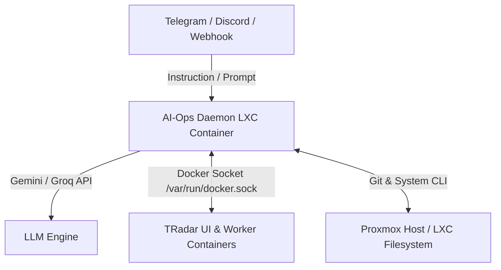
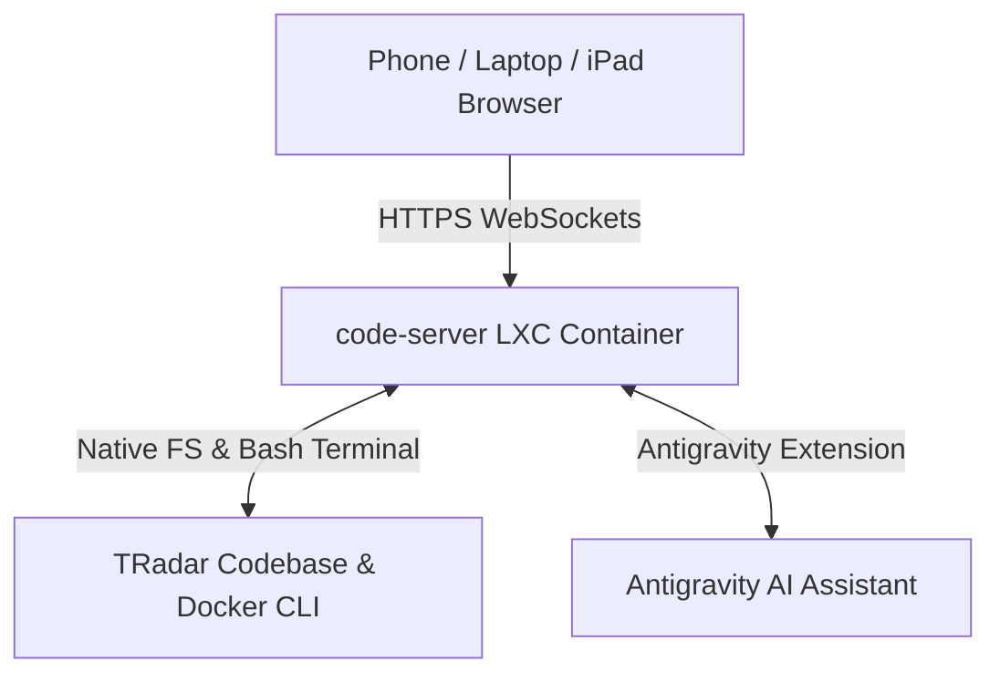
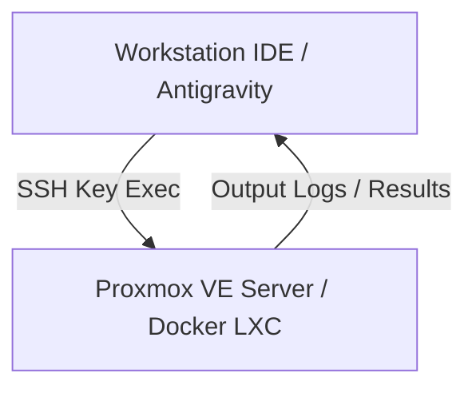

# Proxmox VE AI Automation & Agent Setup Guide

This guide outlines 3 methods for running **Antigravity (AI Coding & Automation Agent)** inside a **Proxmox VE** homelab server to automate tasks, manage Docker containers, run git workflows, and provide 24/7 self-healing capabilities.

---

## 🎯 Architecture Goals

* **Autonomous Server Management:** Give an AI agent terminal and Docker socket access to run `docker compose`, `git pull`, and Python scripts.
* **24/7 Self-Healing:** Auto-restart crashed services or resolve database locks automatically.
* **Remote Access:** Allow pair programming with Antigravity from any phone, laptop, or tablet.

---

## Option 1: 24/7 Autonomous "AI-Ops" Daemon Container (Headless LXC)

A dedicated, lightweight LXC container in Proxmox running an autonomous AI agent process 24/7.



### Key Features
- **Hands-Free Automation:** Listens for scheduled cron jobs or user messages (via Telegram/Discord bot).
- **Docker Socket Access (`/var/run/docker.sock`):** Can restart containers, view `docker logs`, and inspect resource usage.
- **Auto-Healing:** If a healthcheck fails, the agent automatically reads logs, diagnoses the error, and restarts the container or backfills database rows.

### How to Setup
1. Spin up a Debian/Ubuntu LXC container in Proxmox (e.g. CT 105 named `ai-ops`).
2. Mount the Docker socket or grant SSH access to the target application container.
3. Store API keys (`GEMINI_API_KEY`, `GROQ_API_KEY`) in `/etc/ai-agent/.env`.
4. Run an autonomous agent loop (e.g., via `systemd` background service).

---

## Option 2: Browser-Based VS Code Server (`code-server` LXC)

Deploy a full VS Code IDE in your web browser directly inside Proxmox using `code-server`.



### Key Features
- **Code Anywhere:** Open `https://code.yourdomain.com` from any device (phone, iPad, laptop) anywhere in the world.
- **Direct Server Control:** Antigravity runs inside the browser IDE with full access to the server's terminal and files.
- **Live Pair Programming:** Edit Python scripts, modify `docker-compose.yml`, and execute `git push` directly on the server.

### How to Setup (Fast Track)
1. In Proxmox host shell, run the helper script:
   ```bash
   bash -c "$(wget -qLO - https://github.com/tteck/Proxmox/raw/main/ct/code-server.sh)"
   ```
2. Open `http://<LXC_IP>:8080` in your web browser.
3. Open your project folder (`/home/devinv/hammer_candlestick_app`) and start pair programming with Antigravity!

---

## Option 3: Remote SSH Execution Agent (Simplest & Lightest)

Keep Antigravity running on your primary workstation, but give it **SSH Key authentication** to execute commands on your Proxmox server remotely.



### Key Features
- **Zero RAM Impact:** No extra background containers required on Proxmox.
- **Instant Setup:** Uses standard SSH keys (`ssh devinv@192.168.1.xxx`).
- **Remote Commands:** Antigravity can execute commands like:
  ```powershell
  ssh devinv@192.168.1.100 "cd ~/docker/stock-scanner && git pull && docker compose restart"
  ```

### How to Setup
1. Generate an SSH keypair on your workstation (`ssh-keygen -t ed25519`).
2. Copy the public key to your Proxmox server (`ssh-copy-id devinv@192.168.1.100`).
3. Antigravity can now execute remote shell commands directly!

---

## 🛡️ Security & Best Practices

1. **Unprivileged LXC Containers:** Always run Docker and AI agent containers inside **unprivileged LXC containers** in Proxmox to prevent root host escalation.
2. **Environment Variable Protection:** Never commit `.env` files containing `GEMINI_API_KEY` or `GROQ_API_KEY` to public Git repositories.
3. **SSH Key Isolation:** Use dedicated SSH keys with restricted permissions if granting remote execution access.

---

## 📋 Summary Matrix

| Option | Ease of Setup | Resource Overhead | Best Used For |
| :--- | :--- | :--- | :--- |
| **Option 1: 24/7 AI-Ops LXC** | Medium | Low (~250 MB RAM) | 24/7 background automation & container self-healing |
| **Option 2: `code-server` LXC** | Easy (1-Click) | Moderate (~500 MB RAM) | Mobile & remote browser coding from phone/tablet |
| **Option 3: Remote SSH Agent** | Easiest (5 mins) | Zero (Runs on PC) | Quick on-demand server management during dev sessions |
